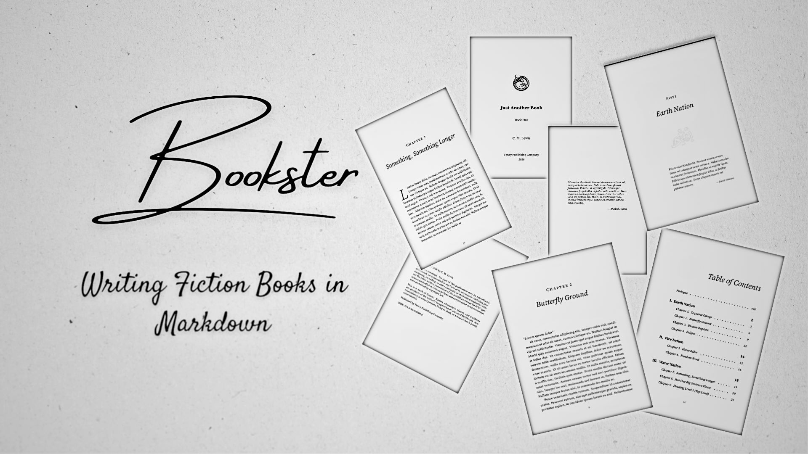

# Bookster

Bookster is a command-line tool that converts markdown files into beautifully formatted PDF books. It leverages the power of Pandoc and LaTeX to create professional-quality documents with ease.

See the [demo](https://sumartian-studios.github.io/bookster/output.pdf) for `examples/book-2`.

## Features

- Meticulously designed LaTeX template.
- Automatically shift chapter sequences up or down to insert or remove content without manual renaming.
- Compile to PDF using a builtin LaTeX template and Lua filters for consistent formatting.
- Automatically convert horizontal rules (`---`) into elegant scene breaks. That means you can write your manuscript in plain markdown without worrying about ugly LaTeX syntax, and Bookster will handle the rest.
- Support for custom metadata (e.g. title, author, cover image) to personalize your book.
- Math and code block support with syntax highlighting.
- Generate statistics about your manuscript, such as word count and chapter lengths.
- Cover pages for parts and chapters, with customizable ornaments.
- More features coming soon...

## Disclaimer

This package is not stable and can break backward compatability without warning. Use with caution and always keep backups of your manuscripts.

## Getting Started

### Dependencies

- Pandoc - a universal document converter
- LaTeX/LuaLaTeX - a typesetting system (you also need to install the various LaTeX packages used in the template, such as `titlesec`, `fancyhdr`, etc.)
- python3 - for running the Bookster script
- uv - for installing the Bookster package
- Source Serif 4 / Source Code Pro - the main font used in the template

### Installation

You can install Bookster directly from GitHub using `uv`:

```bash
uv tool install git+https://github.com/sumartian-studios/bookster.git
```

## Usage

### Adding a Chapter

To insert a new chapter at position 4. This will move the existing chapter-4.md to 5, 5 to 6, and so on, then create a fresh chapter-4.md.

```Bash
bookster --book-dir=examples/book-1 --add-chapter 4
```

### Removing a Chapter

To close the gap after deleting chapter-7.md. This will move 8 to 7, 9 to 8, etc.

```Bash
bookster --book-dir=examples/book-1 --remove-chapter 7
```

### Compiling the Manuscript

Combine all chapters into a single PDF using the bundled LaTeX template and Lua filters.

```Bash
bookster --book-dir=examples/book-1 --compile --output my_novel.pdf --metadata book.yml
```

### Ornaments

See https://muug.ca/mirror/ctan/graphics/pstricks/contrib/pst-vectorian/doc/psvectorian.pdf for a list of available ornaments and their codes.

```yaml
include-body:
  - title: "The Beginning"
    ornament: "horseshoes" # See psvectorian [lookup table](src/bookster/data/template.lua)
    chapters: [1, 10] # [Start, End]
```

### Other Examples

Clone the repository and try out the example book in `examples/book-2` (complete) and `examples/book-1` (barebones):

```bash
bookster --book-dir ./examples/book-2 --chapter-dir chapters --output ./build/output.pdf --compile
bookster --book-dir ./examples/book-2 --chapter-dir chapters --stats
```

## Credits

- Pandoc (GPLv2) - for converting markdown to various formats.
- Latex (LPPL) - for typesetting and PDF generation.

## License

This project is licensed under the GPLv3 License - see the [LICENSE](LICENSE) file for details.
